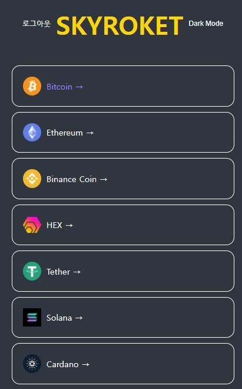
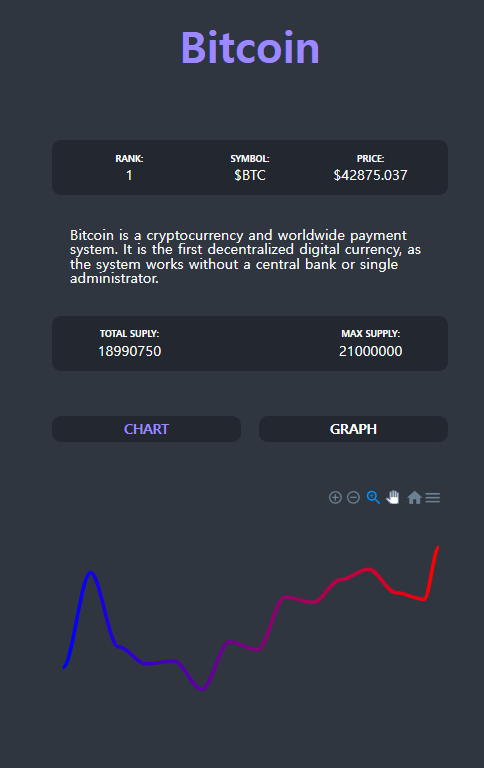

### 1. 소개

SKY ROCKET은 '코인파프리카' 라는 웹에서 OPEN API를 가져와 DATA를 가공하여 사용자들에게 COIN의 정보를 간단하게 제공 해주는 웹 입니다.

예전부터 주변사람들은 코인을 다 하는데 저만 안해서 궁금 했었고 알아보니, 너무 어려워서
생판 모르는 사람도 간단히 볼 수 있는 앱이 있었으면 좋겠다. 생각해서 만들게 되었습니다.

SKY ROCKET은 영어로 떡상이란 뜻을 가지고 있어서 '코인이 떡상했다' 라는 말을 본 떠서 지어 봤습니다.

SKY ROCKET은 기본적으로 REACT를 사용하였고 NODE.JS를 사용하여 SERVER를 구성 하였고 DB는 MONGO DB를 사용하였습니다. 기타 라이브러리는 상태관리 목적으로 RECOIL과 REDUX를
사용하였으며 사용자에게 DATA를 시각적으로 보여주고 싶어서 ApexChart.js 라이브러리를 사용해서 차트 형식으로 2주치와 하루치 해당 코인의 가치 변화를 나타내었습니다.

포트폴리오용으로 만든 프로젝트이다 보니 RECOIL과 REDUX를 둘다 경험 해보고 사용해보고 싶어서 다크모드 구현은 RECOIL, 로그인 로그아웃 회원가입 부분은 REDUX를 사용했습니다.

페이지는 로그인 페이지, 회원가입 페이지, 메인 페이지, 코인 페이지 4개 페이지로 구성되어 있습니다.
메인 페이지에 REACTQUERY를 사용하여 DATA 안의 코인들을 가져와서 1~100까지 순서로 나열
했고 해당 코인을 클릭하게 되면 주소창에 해당 코인이름으로 바뀌면서 넘어가게 됩니다.
코인 페이지로 넘어가게 되면 해당 코인의 소개글과 5분마다 변경 되는 코인의 가치 그리고
2주간 가격 변동 추이와 하루간 가격 변동 추이 차트를 보여 줍니다.
로그인 페이지에선 로그인을 할 수 있게 회원가입 페이지에선 회원가입을 할 수 있게 만들었습니다.

<table align="center">
   <tr>
    <td></td><td></td>
    </tr>
</table>
<h3 align="center">
  SKY ROCKET 랜딩 페이지
</h3>

### 2. 느낀점

1. 차트도 좋지만... 표에 초마다 변화하는 코인의 시세를 구현하고 싶었지만 오픈소스 API에는 일별로 나와있어서 구현하지 못한 것이 아쉬웠다.
2. 상태관리를 redux 로 하다가 다크모드 부분은 규모가 매우 작다보니 redux 로
   진행하기보다는 recoil 로 진행하였는데 redux 보다 간단하고 쉬운 느낌이 들었고 RECOIL에
   흥미를 갖게 되었다.
3. 이전 프로젝트의 로그인 구현은 node.js 에 client 없이 뷰 엔진 PUG 를 사용하여
   구현하였기 때문에 client 와의 통신에 대해서 지식으로만 알고 있었는데
   React.js 를 사용한 client 에 axios 로 로그인 구현을 해보니 server 와 client 가 통신 하는것에 대해 이해할 수 있었다.
4. TypeScript 에 대한 욕심이 생겨서 계획에 없던 typescript 를 공부하며 사용했는데
   자동완성 기능이 실수를 줄여 주기는 하지만 타입선언을 하거나 정의해줄 타입들을 정의 하는데 어려움을 겪었고 경험이 더 필요하다고 생각했다.
5. 관심이 있던 coin 에 관한 앱이라 그런지 부족한 부분을 꾸준히 발전시키고 업데이트 해 보면 더 좋을 것 같다.

---

## Source

- 깃허브 링크

  [<https://github.com/madmanforces/COIN-TRACKER>](https://github.com/madmanforces/COIN-TRACKER)
