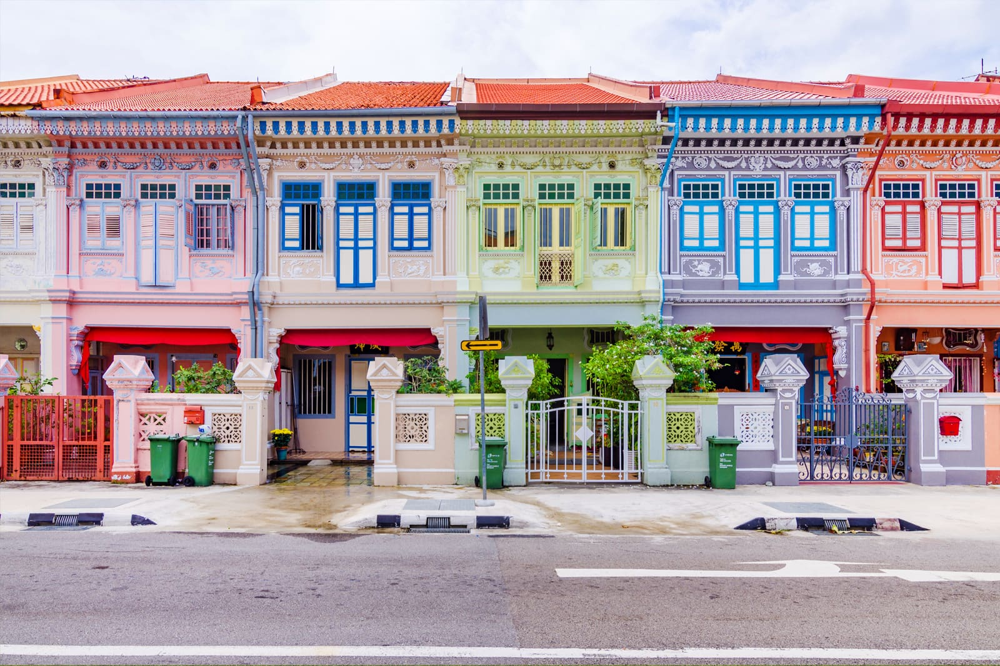
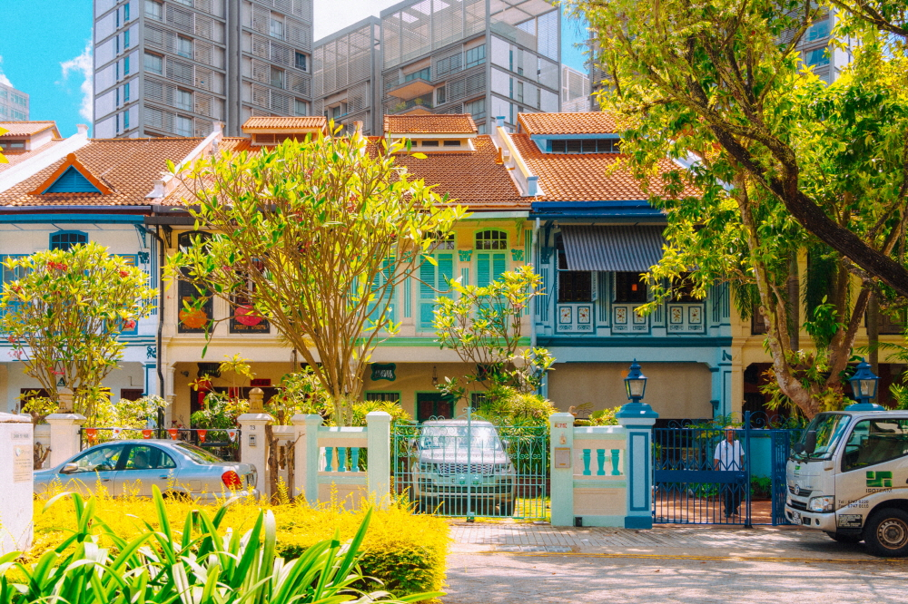
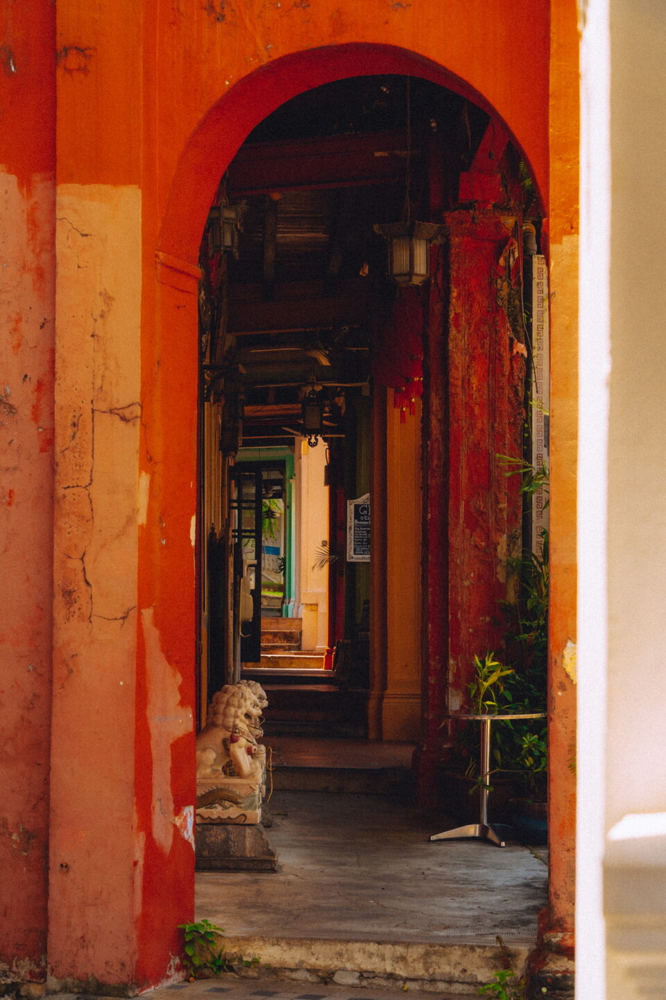
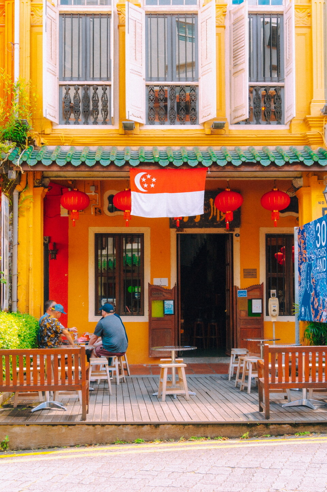

### 1. 소개

이 곳은 "페라니칸 양식"으로 만들어진 건축물이 늘어선 골목길입니다.  
실제로 사람들이 생활하고 있는 곳이라 자연스러운 싱가폴의 일상을 느낄수있을겁니다!  
저희는 오전에 에메랄드 힐을 방문 할 건데요.. 오후엔 사람이 너무 많아요~ ㅎㅎ  
건물들이 이쁘고 길가도 깔끔해서 사진찍기에 딱 좋은곳이라 사람이 많은 시간대는 피해서 정했습니다.  
아! "페라나칸 문화" 라는건 해외에서 이주해 온 남성과 말레이시아 여성 사이에서 태어난 이들에서  
유래한 말인데요, 음,,, 해외문화와 말레이시아 문화가 혼합한 형태를 말합니다.

### 2. 거리

<table align="center">
   <tr>
    <td></td><td></td>  
    </tr>
</table>
<table align="center">
   <tr>
    <td></td><td></td>
    </tr>
</table>

---

## Source

-
